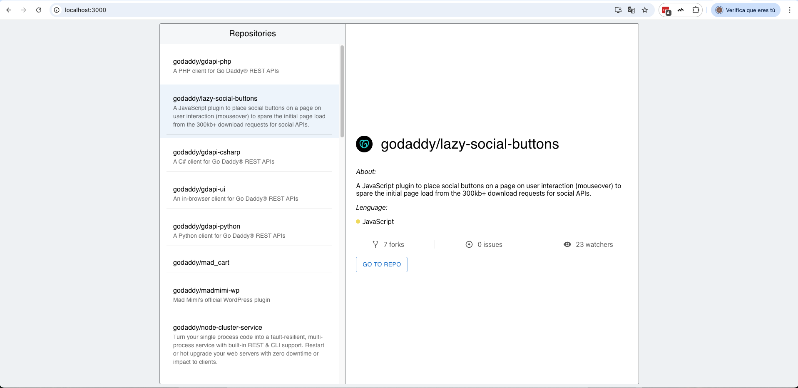

# GoDaddy Repositories Viewer

A simple web application built with React and TypeScript to list public repositories from the [GoDaddy GitHub organization](https://github.com/godaddy) and view details about each repository using 'https://api.github.com/orgs/godaddy/repos' API.

---

## 📸 Screenshot



---

## ✨ Features

- Lists public repositories from GoDaddy.
- Displays detailed information about a selected repository:
  - Full name
  - Description
  - Primary language
  - Number of forks
  - Open issues
  - Watchers
  - Link to the GitHub page
- Built with [Material UI](https://mui.com/) components.
- Data fetched via [Axios](https://axios-http.com/) using [React Query](https://tanstack.com/query).
- Unit tests using [React Testing Library](https://testing-library.com/docs/react-testing-library/intro).

---

## 🛠️ Tech Stack

- React 19
- TypeScript
- Material UI 7
- Axios 0.27.2
- React Query 5
- React Testing Library + Jest

---

## 📁 Project Structure

```
src/
│
├── apis/ # API requests and response types
│ ├── api.d.ts
│ └── requests.ts
│
├── components/ # Common UI components and overrides
│ └── MainTheme.ts
│
├── pages/ # Page-level functionality
│ └── repositories/
│ ├── index.tsx # Page container
│ ├── List.tsx # Repository list component
│ ├── Detail.tsx # Repository detail component
│ └── hooks/
│ └── repositories.ts
```

---

## 🚀 Getting Started

### 1. Clone the repository

```bash
git clone https://github.com/your-username/list-godaddy-repos.git
cd list-godaddy-repos
```

### 2. Install dependencies

```bash
npm install
```

### 3. Start the development server

```bash
npm start
```

The app will be available at http://localhost:3000.

---

## 🧪 Running Unit Tests

Unit tests are written with React Testing Library and Jest.

To run the test suite:

```bash
npm test
```

- Tests are located next to the files they cover (e.g., index.test.tsx).
- External API calls are mocked using Jest.

---

## ⚠️ Notes

- This project does not currently support mobile or responsive layouts.
- There is no production deployment — it runs locally only.

---

## 📄 License

This project is for educational and internal use. No license specified.

---
